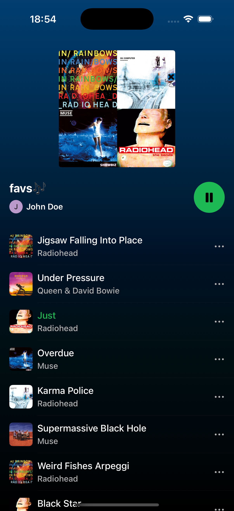
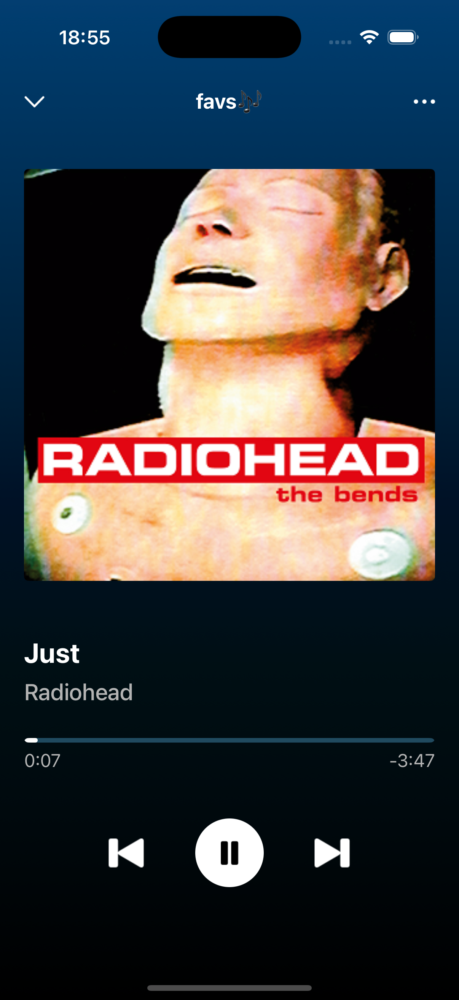

# 🎵 MusicPlayer

A simple Spotify-inspired music player built with SwiftUI and AVFoundation.

## 🚀 Features

- **Audio Playback:** Full play/pause/skip functionality using AVAudioPlayer.
- **Dynamic Progress Tracking:** A real-time progress bar with formatted timestamps.
- **UIKit Integration** UIProgressView bridged into SwiftUI via UIViewRepresentable.

## 📱 Screenshots

    
 
## 🛠 Tech Stack

- **Language:** Swift  
- **UI Framework:** SwiftUI
- **Architecture:** MVVM
- **Audio:** AVFoundation
